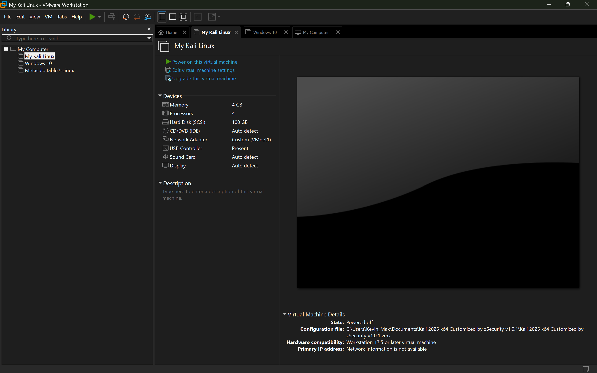
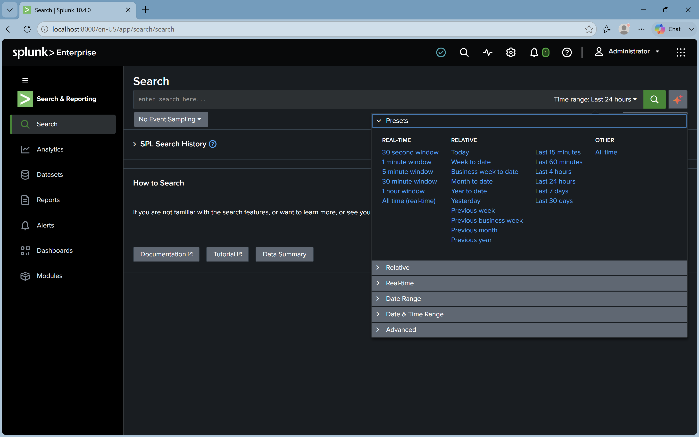
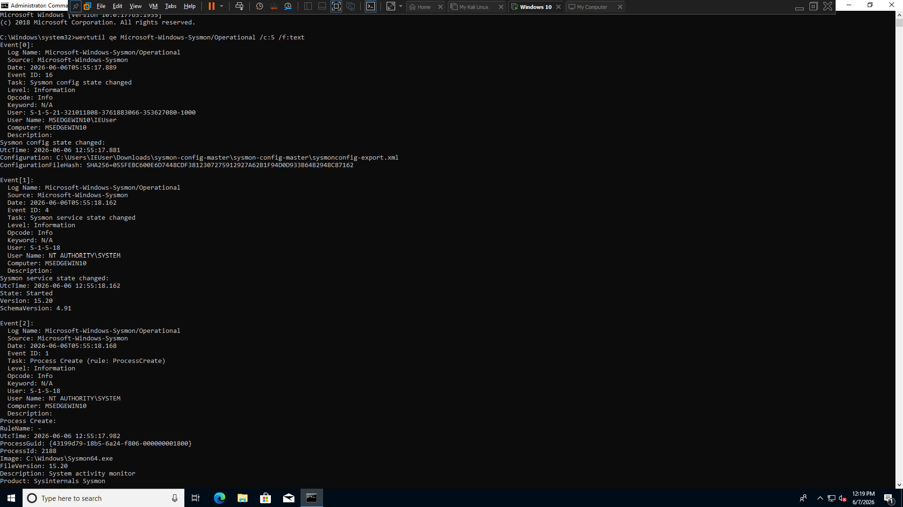
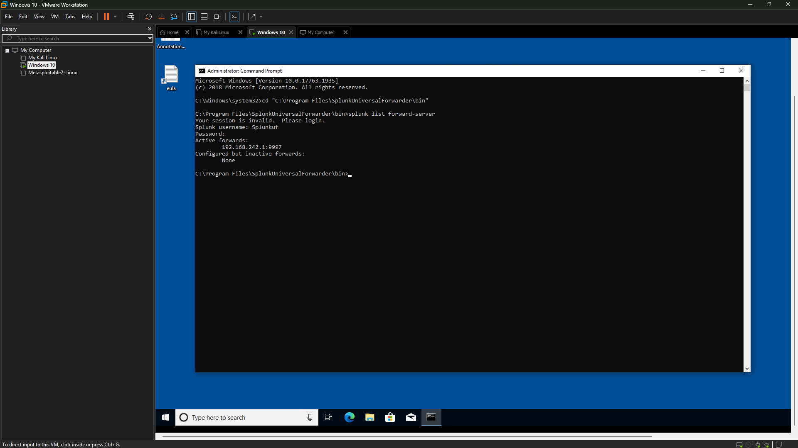
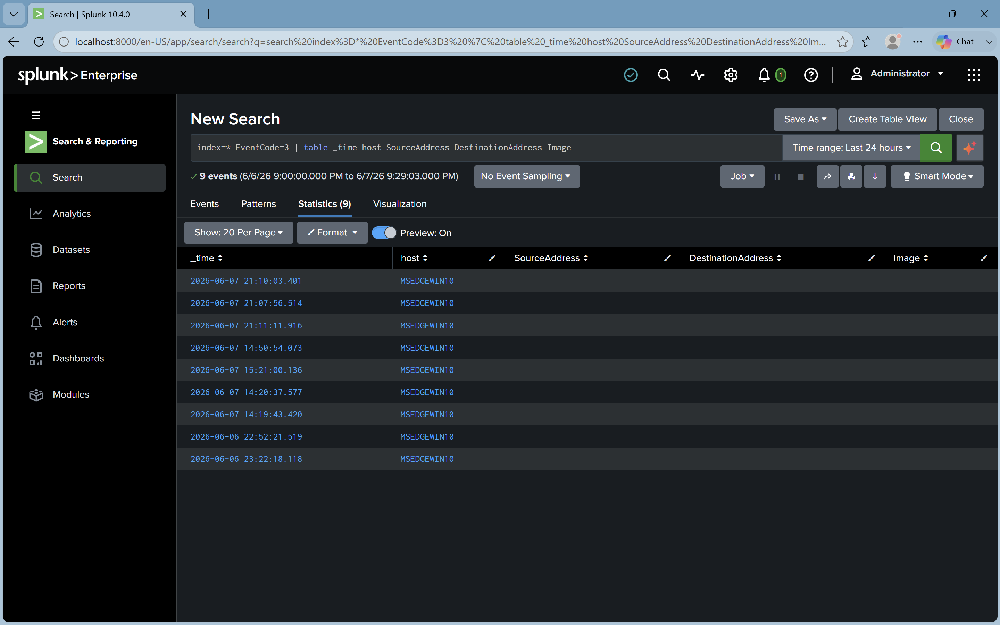
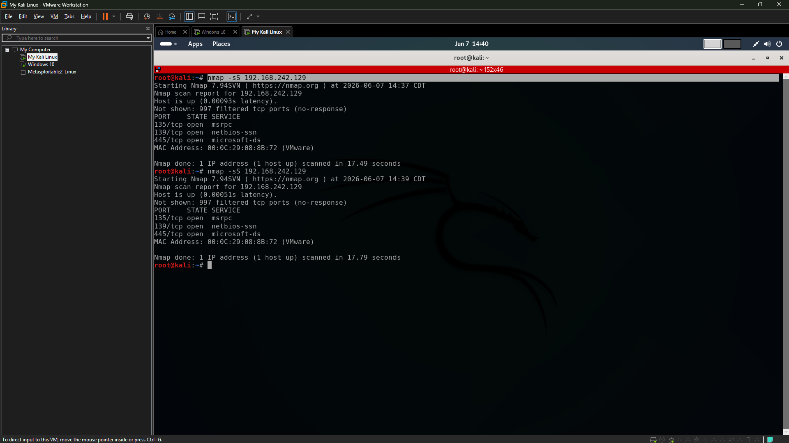

# SOC Monitoring Lab with Splunk, Sysmon, and Kali Linux

## Overview

This project is a virtual Security Operations Center (SOC) monitoring lab built using VMware Workstation Pro. It simulates a real-world SOC environment where a Windows 10 endpoint generates security telemetry using Sysmon, logs are collected using Splunk Universal Forwarder, and analyzed in Splunk Enterprise. A Kali Linux machine is used to generate network traffic and simulate attacker behavior.

The purpose of this project is to demonstrate practical cybersecurity and SOC skills including log collection, endpoint monitoring, SIEM analysis, and basic attack simulation.

---

## Skills Demonstrated

- SOC Monitoring and Log Analysis  
- SIEM (Splunk Enterprise) Configuration  
- Endpoint Detection (Sysmon)  
- Log Forwarding (Splunk Universal Forwarder)  
- Windows Event Log Analysis  
- Network Traffic Analysis  
- Basic Threat Simulation (Kali Linux)  
- Virtual Machine Lab Setup  
- Cybersecurity Documentation  

---

## Tools Used

- Splunk Enterprise (SIEM)
- Splunk Universal Forwarder
- Sysmon (System Monitor by Sysinternals)
- Windows 10 Virtual Machine (Endpoint)
- Kali Linux (Attack Simulation)
- VMware Workstation Pro
- Nmap (Network Scanning Tool)

---

# Phase 1: Lab Environment Setup

## Overview

In this phase, the virtual SOC environment was built using VMware Workstation Pro. Multiple virtual machines were deployed including a Windows 10 endpoint (target system), Kali Linux (attacker system), and a Splunk Enterprise server for centralized log analysis.

---

## 1. VMware Workstation Lab Topology

The virtual environment consists of:

- Windows 10 VM (Endpoint with Sysmon)
- Kali Linux VM (Attacker machine)
- Splunk Enterprise (SIEM Server)

---

## 2. Splunk Enterprise Installation

Splunk Enterprise was installed on the host system and configured as the central SIEM platform for log ingestion and analysis.

---

# Phase 2: Endpoint Monitoring Setup

## Overview

This phase focuses on enabling endpoint telemetry collection using Sysmon and forwarding logs to Splunk using the Universal Forwarder.

---

## 1. Sysmon Installation on Windows 10

Sysmon was installed on the Windows 10 endpoint to capture detailed system activity including:

- Process creation
- Network connections
- DNS queries
- System-level events

---

## 2. Splunk Universal Forwarder Configuration

The Splunk Universal Forwarder was installed on the Windows 10 endpoint to send logs to the Splunk Enterprise server.

Forwarder status confirmed active connection:

---

# Phase 3: Security Event Monitoring

## Overview

In this phase, Splunk was used to analyze Windows Event Logs and Sysmon telemetry from the endpoint.

---

## 1. Process Creation Events (EventCode 1)

Process creation events were collected from the Windows 10 endpoint showing executed processes and system activity.

---

## 2. Network Connection Events (EventCode 3)

Network connection events were captured showing communication between systems within the lab environment.

---

# Phase 4: Attack Simulation (Kali Linux)

## Overview

Kali Linux was used to simulate basic attacker behavior by performing a network scan against the Windows 10 endpoint using Nmap.

---

## 1. Network Scan from Kali Linux

A TCP SYN scan was performed against the Windows 10 VM to identify open ports and services.

---

## 2. Detection in Splunk

The scan activity was detected and logged in Splunk through Sysmon EventCode 3, demonstrating SIEM visibility of network activity.

---

# Phase 5: Key Findings

- Sysmon successfully captured endpoint-level activity
- Splunk successfully ingested logs from Windows 10 endpoint
- Network connections were visible through EventCode 3
- Kali Linux scan activity was detected in Splunk
- Full visibility from endpoint → SIEM was achieved

---

# Security Value Demonstrated

This lab demonstrates the core SOC workflow:

**Endpoint → Telemetry → Forwarding → SIEM → Detection**

It simulates how real SOC analysts monitor, detect, and investigate suspicious activity in enterprise environments.

---

# Future Improvements

- Create Splunk detection alerts for Nmap scans
- Build SOC dashboards (network + process monitoring)
- Add brute-force attack simulation
- Integrate MITRE ATT&CK mapping
- Add Windows Defender telemetry ingestion
- Expand lab with Active Directory environment

---

# Author

Cybersecurity SOC Lab Project created as a hands-on demonstration of SIEM monitoring, endpoint detection, and basic threat simulation skills.
